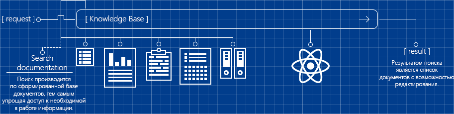

# Knowledge-Base

## Возможности
- [База знаний](#user-content-sample-1)
- [ПО/Сервисы](#user-content-sample-2)
    - [Сервисы](#user-content-sample-3)
    - [Программы](#user-content-sample-4)
    - [Закладки](#user-content-sample-5)
    
`Дополнительные сервисы`

- [Расписания](#user-content-sample-6)
    - [Отпуск](#user-content-sample-7)
    - [Обед](#user-content-sample-8)
    - [Мероприятия](#user-content-sample-9)
- [Праздники](#user-content-sample-10)
    - [Поздравления](#user-content-sample-11)
    - [Тайный санта](#user-content-sample-12)
    
`Дополнительный сервис для управления`

- [Добавить нового пользователя](#content-13)
- [Опоздания](#user-content-sample-14)

`Оповещения об изменениях документах`

- [Изменения](#user-content-sample-15)

`Литература`

- [Дополнительная литература](#user-content-sample-16)

***

###  База знаний
Поиск по всей документации, находящейся в базе. Позволяет упростить и ускорить процесс поиск необходимых документов.

###  Сервисы
Общий список всех адресов внутренних сервисов и документация.

###  Программы
Список необходимого программного обеспечения и документация.

###  Закладки
Закладки экспортированные из браузера всех дополнительных сервисов.

***

###  Отпуск

###  Обед

###  Мероприятия

***

###  Поздравления
За неделю до дня рождения сотрудника, у всех пользователей, появляется всплывающая форма, в которой возможно указать поздравление.

###  Тайный санта

***

###  Добавить нового пользователя

###  Опоздания
Определяется в начале рабочего дня, после первого обновления страницы.

***

###  Изменения
Список документации в которой были произведены изменения. О изменениях в документации отправляется электронное сообщения на внутреннюю почту.

***

###  Дополнительная литература
